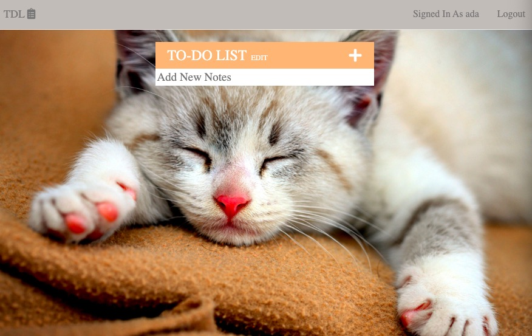

# A complex todolist website
This project uses react as frontend, express as backend and mongoose as database, RESTful API get and post, use ejs to show view which embeded javascript into html

### First view of app
Set goal for today

### Login
Need to login first

### Signup 
First time need to signup

### After success signin to use app
Start to add your todo list

### Can remove and edite your list once you add

### Can remove add list row

## Available Scripts
In the project directory, you can run:

### `mongod`
start mongoose server

### `cd TDL_APP && node app.js`
start application